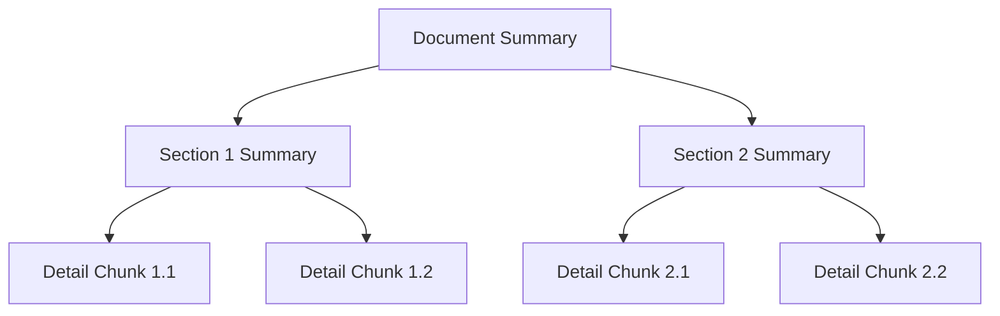
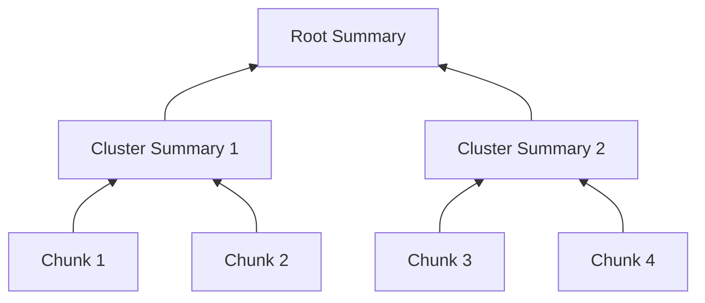

# Alternative Chunking Strategies

An analysis of chunking approaches for RAG systems, with recommendations for PrismRAG.

## Current PrismRAG Strategy

```
Structure-aware + Token-based + Context Enrichment
├── Split by document structure (pages/sheets)
├── Split by markdown headers
├── 1000 tokens target, 200 overlap
└── Prepend document/section/location context
```

This is already **above average** — the context enrichment is particularly good.

---

## Alternative Chunking Strategies

### 1. **Semantic Chunking** (Topic-based splits)
Split when the semantic meaning changes, not at fixed token counts.

```python
# Example using sentence embeddings to detect topic shifts
from sentence_transformers import SentenceTransformer

def semantic_chunk(text, threshold=0.5):
    sentences = split_into_sentences(text)
    embeddings = model.encode(sentences)
    
    chunks = []
    current_chunk = [sentences[0]]
    
    for i in range(1, len(sentences)):
        similarity = cosine_similarity(embeddings[i-1], embeddings[i])
        if similarity < threshold:  # Topic shift detected
            chunks.append(" ".join(current_chunk))
            current_chunk = []
        current_chunk.append(sentences[i])
    
    return chunks
```

| Pros | Cons |
|------|------|
| Chunks are semantically coherent | Slower (requires embedding each sentence) |
| Variable size adapts to content | Threshold tuning required |
| Better for narrative documents | May create very small/large chunks |

**Best for:** Long-form documents, reports, articles

---

### 2. **Agentic/LLM-based Chunking**
Use an LLM to decide where to split.

```python
CHUNKING_PROMPT = """
Analyze this document and identify logical section boundaries.
Return a list of split points where the topic or context changes.
Consider: headers, topic shifts, paragraph boundaries, logical units.
"""

def llm_chunk(text):
    response = llm.invoke(CHUNKING_PROMPT + text)
    split_points = parse_split_points(response)
    return split_at_points(text, split_points)
```

| Pros | Cons |
|------|------|
| Highest quality splits | Expensive (LLM call per document) |
| Understands context | Slow for large documents |
| Can handle complex structures | Non-deterministic |

**Best for:** High-value documents where quality > cost

---

### 3. **Parent-Child (Hierarchical) Chunking** ⭐ Recommended Addition
Store both summary chunks and detail chunks. Retrieve summaries, expand to details.

```python
def hierarchical_chunk(document):
    # Level 1: Full document summary
    summary = llm.summarize(document)
    
    # Level 2: Section summaries  
    sections = split_by_headers(document)
    section_summaries = [llm.summarize(s) for s in sections]
    
    # Level 3: Detail chunks (current approach)
    detail_chunks = token_based_chunk(document)
    
    return {
        "summary": summary,           # Embed this
        "sections": section_summaries, # Embed these
        "details": detail_chunks,      # Embed these
        "links": build_hierarchy()     # Parent-child relationships
    }
```



| Pros | Cons |
|------|------|
| Better for "big picture" questions | More complex indexing |
| Can retrieve at right granularity | Higher storage cost |
| Reduces "lost in the middle" problem | Requires hierarchy management |

**Best for:** Technical manuals, specifications, multi-level queries

---

### 4. **Proposition-based Chunking**
Break text into atomic, self-contained propositions.

```python
PROPOSITION_PROMPT = """
Break this text into atomic propositions. Each proposition should:
- Be self-contained (understandable without context)
- Represent a single fact or claim
- Include necessary context from the original

Text: "The CEO, John Smith, announced Q3 revenue of $5M, up 20% YoY."

Propositions:
1. John Smith is the CEO of the company.
2. John Smith announced Q3 revenue figures.
3. Q3 revenue was $5 million.
4. Q3 revenue increased 20% compared to the same quarter last year.
"""
```

| Pros | Cons |
|------|------|
| Highly precise retrieval | Very expensive (LLM per chunk) |
| Great for fact-based QA | Loses narrative flow |
| Each chunk is atomic | Explosion in chunk count |

**Best for:** Compliance, legal, fact-checking use cases

---

### 5. **Late Chunking** (New Approach)
Embed the full document first, then chunk the embeddings.

```python
# Traditional: chunk → embed
chunks = chunk(document)
embeddings = [embed(c) for c in chunks]

# Late chunking: embed → chunk
full_embedding = embed(document, output_hidden_states=True)
chunk_embeddings = split_embedding(full_embedding, chunk_boundaries)
```

| Pros | Cons |
|------|------|
| Embeddings have full document context | Requires special embedding models |
| No context loss at chunk boundaries | Not all models support this |
| State-of-the-art retrieval quality | More complex implementation |

**Best for:** When using models that support late chunking (e.g., Jina embeddings)

---

### 6. **RAPTOR** (Recursive Abstractive Processing)
Build a tree of summaries at multiple abstraction levels.



```python
def raptor_index(chunks):
    # Level 0: Original chunks
    levels = [chunks]
    
    while len(levels[-1]) > 1:
        # Cluster similar chunks
        clusters = cluster_chunks(levels[-1])
        # Summarize each cluster
        summaries = [llm.summarize(c) for c in clusters]
        levels.append(summaries)
    
    # Index all levels
    return flatten(levels)
```

| Pros | Cons |
|------|------|
| Excellent for multi-hop reasoning | Complex to implement |
| Handles "big picture" + detail | High LLM cost for summarization |
| Research-backed improvements | Slower indexing |

**Best for:** Complex reasoning, research documents

---

## Comparison Matrix

| Strategy | Retrieval Quality | Cost | Complexity | Best For |
|----------|-------------------|------|------------|----------|
| **Current (Token + Context)** | ⭐⭐⭐⭐ | Low | Low | General purpose |
| Semantic Chunking | ⭐⭐⭐⭐ | Medium | Medium | Narrative docs |
| LLM-based Chunking | ⭐⭐⭐⭐⭐ | High | Medium | High-value docs |
| **Parent-Child** | ⭐⭐⭐⭐⭐ | Medium | Medium | Technical manuals |
| Proposition-based | ⭐⭐⭐⭐⭐ | Very High | High | Compliance/Legal |
| Late Chunking | ⭐⭐⭐⭐⭐ | Low | High | If model supports |
| RAPTOR | ⭐⭐⭐⭐⭐ | High | High | Complex reasoning |

---

## Recommendation for PrismRAG

Given PrismRAG's use case (technical documents, specifications, Q&A workflows), we recommend **adding Parent-Child chunking** as an enhancement:

```python
# Enhanced chunk_documents.py

def chunk_document_hierarchical(content: str, source_file: str) -> Dict:
    # Current detail chunks (keep existing logic)
    detail_chunks = chunk_document(...)  # existing function
    
    # Add section summaries (new)
    sections = split_by_document_sections(content, source_file)
    section_summaries = []
    for section_id, section_content in sections:
        summary = generate_section_summary(section_content)  # LLM call
        section_summaries.append({
            "chunk_id": f"{hash}_section_{section_id}",
            "content": summary,
            "type": "summary",
            "children": [c["chunk_id"] for c in detail_chunks if c["location"] == section_id]
        })
    
    return {
        "summaries": section_summaries,  # Index these too
        "details": detail_chunks
    }
```

### Benefits for PrismRAG

1. **Keep current high-quality detail retrieval** - No regression
2. **Add summary-level retrieval** - For "what does this document cover?" questions
3. **Enable "expand to details" pattern** - UI can show summary → drill down
4. **Improve broad question answers** - Questions spanning multiple pages

### Implementation Effort

| Task | Effort |
|------|--------|
| Add summary generation function | 1 day |
| Update chunk schema with `type` field | 0.5 day |
| Update search index schema | 0.5 day |
| Modify retrieval to use hierarchy | 1-2 days |
| UI for expand/collapse | 1-2 days |
| **Total** | **4-6 days** |

---

## References

- [RAPTOR: Recursive Abstractive Processing for Tree-Organized Retrieval](https://arxiv.org/abs/2401.18059)
- [Late Chunking (Jina AI)](https://jina.ai/news/late-chunking-in-long-context-embedding-models/)
- [Proposition-based Retrieval](https://arxiv.org/abs/2312.06648)
- [LangChain Text Splitters](https://python.langchain.com/docs/modules/data_connection/document_transformers/)
