# PrismRAG Solution Critique

A comprehensive technical analysis of the PrismRAG document intelligence solution accelerator.

**Review Date:** December 15, 2025  
**Reviewer Expertise:** LLMs, RAG, Azure Agentic Search, Knowledge Management, Search Evaluation, Cloud Architecture, Azure Well-Architected Framework

---

## Table of Contents

1. [Executive Summary](#executive-summary)
2. [Top-Level Architecture Overview](#top-level-architecture-overview)
3. [System Flow Analysis](#system-flow-analysis)
4. [Strengths & Best Practices](#strengths--best-practices)
5. [Areas for Improvement](#areas-for-improvement)
6. [Security Analysis](#security-analysis)
7. [Performance & Scalability](#performance--scalability)
8. [Cost Optimization Analysis](#cost-optimization-analysis)
9. [RAG Implementation Quality](#rag-implementation-quality)
10. [Next Steps & Recommendations](#next-steps--recommendations)
11. [Conclusion](#conclusion)

---

## Executive Summary

PrismRAG is a well-architected document intelligence solution accelerator that transforms unstructured documents (PDFs, Excel, emails) into queryable knowledge using Azure AI services. The solution demonstrates several innovative approaches, particularly the **hybrid extraction strategy** that significantly reduces Vision API costs, and the adoption of **Azure AI Search Agentic Retrieval** for intelligent query decomposition.

### Key Highlights

| Category | Assessment | Notes |
|----------|------------|-------|
| **Architecture** | ⭐⭐⭐⭐ Strong | Clean separation of concerns, modular design |
| **RAG Implementation** | ⭐⭐⭐⭐⭐ Excellent | Context-aware chunking, hybrid search, semantic ranking |
| **Cost Optimization** | ⭐⭐⭐⭐⭐ Excellent | 70%+ Vision cost reduction via hybrid approach |
| **Security** | ⭐⭐⭐ Adequate | Good for demo; needs hardening for production |
| **Scalability** | ⭐⭐⭐⭐ Good | Stateless backend, incremental processing |
| **Observability** | ⭐⭐⭐ Adequate | Application Insights integrated; needs enhancement |
| **Testing** | ⭐⭐ Needs Work | Basic test infrastructure; coverage gaps |

---

## Top-Level Architecture Overview

PrismRAG follows a three-tier architecture with clear separation between presentation, business logic, and data layers. The solution leverages Azure PaaS services for AI capabilities, search, and storage.

#### 1. High-Level Overview

```mermaid
graph LR
    FE[🖥️ Frontend<br/>Vue 3 + Vite]
    API[⚡ API<br/>FastAPI]
    PROC[⚙️ Processing<br/>RAG Pipeline]
    AZURE[☁️ Azure<br/>AI Services]

    FE <-->|REST| API
    API --> PROC
    PROC --> AZURE
    API --> AZURE

    style AZURE fill:#0078D4,color:#fff
```



---

#### 2. API Services Layer


---

#### 3. Document Extraction Pipeline

```mermaid
graph LR
    subgraph "Input"
        PDF[📄 PDF]
        XLS[📊 Excel]
        MSG[📧 Email]
    end

    subgraph "Extraction"
        DI[Azure Doc Intelligence]
        OP[openpyxl]
        OX[python-oxmsg]
    end

    subgraph "AI Enhancement"
        ENH[AI Enhancer]
    end

    PDF --> DI --> MD[📝 Markdown]
    XLS --> OP --> ENH
    MSG --> OX --> ENH

    ENH --> MD

    style DI fill:#0078D4,color:#fff
    style ENH fill:#0078D4,color:#fff
```



---

#### 4. RAG Pipeline

```mermaid
graph LR
    MD[📝 Markdown] --> DD[Deduplicate<br/>SHA256]
    DD --> CH[Chunk<br/>Structure-aware]
    CH --> EMB[Embed<br/>text-embedding-3-large]
    EMB --> IDX[Index<br/>Azure AI Search]

    style EMB fill:#0078D4,color:#fff
    style IDX fill:#0078D4,color:#fff
```



---

#### 5. Query & Retrieval Flow

```mermaid
graph LR
    Q[❓ Query] --> KA[Knowledge Agent]
    KA --> PLAN[Query Planning]
    PLAN --> SEARCH[Parallel Search]
    SEARCH --> RANK[Semantic Rerank]
    RANK --> SYNTH[Answer Synthesis]
    SYNTH --> A[✅ Answer + Citations]

    style KA fill:#0078D4,color:#fff
    style SEARCH fill:#0078D4,color:#fff
```



---

#### 6. Azure Services Integration


---

#### 7. Workflow Execution

```mermaid
graph LR
    CFG[📋 Workflow Config] --> WA[Workflow Agent]
    WA --> |For each Q| KA[Knowledge Agent]
    KA --> ANS[Answer]
    ANS --> SAVE[Save Result]
    SAVE --> EVAL[Evaluate]
    EVAL --> SCORES[Quality Scores]

    style WA fill:#0078D4,color:#fff
    style KA fill:#0078D4,color:#fff
```



### Component Responsibilities

| Component | Technology | Purpose |
|-----------|------------|---------|
| **Frontend** | Vue 3 + Vite | Dashboard, project management, query interface, workflow execution |
| **Backend API** | FastAPI (Python 3.11) | REST endpoints, service orchestration, async task management |
| **Storage Service** | Azure Blob / Azurite | Project isolation, document storage, results persistence |
| **Extraction Agents** | Microsoft Agent Framework | Hybrid document processing with local + AI enhancement |
| **RAG Pipeline** | LangChain + tiktoken | Deduplication, structure-aware chunking, embedding generation |
| **Search** | Azure AI Search | Hybrid search (vector + keyword), semantic ranking, agentic retrieval |
| **Workflow Agent** | Microsoft Agent Framework | Config-driven Q&A automation with strict grounding |
| **Evaluation** | Azure AI Evaluation SDK | Answer quality assessment (relevance, coherence, groundedness, fluency) |

---

## System Flow Analysis

### Document Processing Pipeline

The pipeline follows an 8-stage sequential process with clear checkpoints:


### Query Execution Flow


### Workflow Execution Flow


---

## Strengths & Best Practices

### 1. Document Extraction Strategy (Excellent)

The solution uses Azure-native services and permissively-licensed libraries for extraction:

```
Extraction                  →    AI Enhancement (When Needed)
├── Azure Doc Intelligence  →    PDF markdown output (no post-processing needed)
├── openpyxl               →    Excel Enhancement Agent
└── python-oxmsg           →    Email Enhancement Agent
```

**Key strengths:**
- **Azure Document Intelligence**: Consistent high-quality markdown output with HTML tables, figures, and layout detection
- **No restrictive licenses**: All dependencies are MIT/BSD/Apache 2.0 (no AGPL/GPL)
- **Managed service**: Azure handles scaling, updates, and model improvements
- **Cost impact**: 70%+ reduction in Vision API costs

### 2. Contextual Chunk Enrichment (Excellent)

The chunking implementation adds document context to each chunk before embedding:

```python
# Context prefix prepended to each chunk
Document: Technical Manual
Section: Safety Requirements > Electrical
Location: Page 5

[chunk content...]
```

This dramatically improves retrieval by embedding both **what** the content says and **where** it comes from.

### 3. Azure AI Search Agentic Retrieval (Excellent)

The solution adopts the latest Azure AI Search capabilities:
- **Query planning**: LLM breaks complex questions into focused subqueries
- **Parallel execution**: Subqueries run simultaneously for speed
- **Semantic reranking**: Results filtered for relevance
- **Smart retry logic**: Simplified → expanded queries on empty results

### 4. Project Isolation (Good)

Each project is fully isolated:
- Separate blob storage prefix: `{container}/{project}/`
- Dedicated search index: `prism-{project}-index`
- Dedicated knowledge source and agent per project
- No cross-project data leakage

### 5. Structured Answer Evaluation (Good)

Integration of Azure AI Evaluation SDK for answer quality:
- **Relevance**: Does the answer address the question?
- **Coherence**: Is the answer logically consistent?
- **Fluency**: Is the language natural and readable?
- **Groundedness**: Is the answer supported by retrieved context?

### 6. Infrastructure as Code (Good)

Complete Bicep templates for reproducible deployments:
- All Azure resources declaratively defined
- Environment parameterization
- AZD integration for one-command deployment
- Managed identity for Container Apps to Blob Storage

### 7. Config-Driven Workflows (Good)

Workflows are fully user-configurable via JSON:
```json
{
  "sections": [{
    "template": "Answer based on technical documents...",
    "questions": [
      { "question": "...", "instructions": "..." }
    ]
  }]
}
```

No hardcoded domain logic—adapts to any document set.

### 8. Strict Grounding Instructions (Good)

The Knowledge Agent includes explicit grounding rules:
- Only answer from document content
- Never use general knowledge
- Always cite sources with page numbers
- Distinguish "NOT FOUND" vs "EXPLICITLY EXCLUDED"
- Mark assumptions clearly

---

## Areas for Improvement

### 1. Authentication & Authorization (Critical for Production)

**Current State:**
- Password-based authentication only
- Single password for all users
- No role-based access control

**Recommended:**
```python
# Current
AUTH_PASSWORD = os.getenv("AUTH_PASSWORD")

# Production-ready
# - Integrate Microsoft Entra ID (Azure AD)
# - Implement RBAC per project
# - Add API key rotation
# - Audit logging for compliance
```

**Impact:** Security vulnerability for production deployment.

### 2. Error Handling & Resilience

**Current State:**
- Basic try/catch with logging
- Limited retry logic (embedding generation only)
- No circuit breaker patterns

**Recommended:**
```python
# Add resilience patterns
from tenacity import retry, stop_after_attempt, wait_exponential

@retry(
    stop=stop_after_attempt(3),
    wait=wait_exponential(multiplier=1, min=4, max=60)
)
async def call_azure_openai():
    # Resilient API call
```

### 3. Task Queue & State Management

**Current State:**
```python
# In-memory task storage
self._tasks: Dict[str, PipelineTask] = {}
```

**Issues:**
- Tasks lost on container restart
- No distributed task coordination
- Memory pressure with many concurrent tasks

**Recommended:**
- Use Azure Queue Storage or Service Bus for task queuing
- Use Redis or Cosmos DB for task state
- Implement dead-letter queue for failed tasks

### 4. Test Coverage

**Current State:**
- Test fixtures exist in `conftest.py`
- Limited actual test files (5 test files)
- No end-to-end tests
- No load/performance tests

**Recommended:**
- Unit tests for each service (target 80% coverage)
- Integration tests for API endpoints
- Contract tests for external API dependencies
- Load tests for pipeline stages

### 5. Observability & Debugging

**Current State:**
- Application Insights integrated
- Basic logging with custom `logging_config.py`
- No distributed tracing
- Limited metrics

**Recommended:**
```python
# Add OpenTelemetry tracing
from opentelemetry import trace
from opentelemetry.instrumentation.fastapi import FastAPIInstrumentor

tracer = trace.get_tracer(__name__)

async def process_document():
    with tracer.start_as_current_span("process_document") as span:
        span.set_attribute("project_id", project_id)
        span.set_attribute("document_type", "pdf")
```

### 6. API Versioning

**Current State:**
- No API versioning
- Breaking changes would affect all clients

**Recommended:**
```python
app.include_router(projects.router, prefix="/api/v1/projects")
```

### 7. Configuration Management

**Current State:**
- Environment variables for all configuration
- No validation at startup
- No centralized configuration

**Recommended:**
- Pydantic Settings for type-safe configuration
- Azure App Configuration for centralized management
- Feature flags for gradual rollout

```python
from pydantic_settings import BaseSettings

class Settings(BaseSettings):
    azure_openai_endpoint: str
    azure_openai_api_key: str
    azure_search_endpoint: str
    
    class Config:
        env_file = ".env"
```

### 8. Documentation Gaps

**Missing:**
- API documentation (OpenAPI/Swagger exists but not customized)
- Architecture Decision Records (ADRs)
- Runbook for operations
- Contribution guidelines (CONTRIBUTING.md exists but is sparse)

---

## Security Analysis

### Current Security Posture

| Control | Status | Notes |
|---------|--------|-------|
| Authentication | ⚠️ Basic | Password-only; not production-ready |
| Authorization | ❌ Missing | No RBAC implementation |
| Secrets Management | ⚠️ Partial | Uses env vars; Key Vault recommended |
| Network Security | ⚠️ Basic | HTTPS via Container Apps; no private endpoints |
| Data Encryption | ✅ Good | Azure Storage encryption at rest; TLS in transit |
| Input Validation | ⚠️ Partial | FastAPI validation; more needed for file uploads |
| Audit Logging | ❌ Missing | No user action audit trail |
| Dependency Scanning | ❌ Missing | No automated CVE scanning |

### Security Recommendations

1. **Immediate (Pre-Production):**
   - Implement Entra ID authentication
   - Add private endpoints for Azure services
   - Enable Azure Key Vault for secrets
   - Add input validation for file uploads (type, size, content)

2. **Short-Term:**
   - Implement RBAC with project-level permissions
   - Add audit logging for compliance
   - Enable Azure Defender for Container Apps
   - Configure WAF rules

3. **Ongoing:**
   - Automated dependency scanning (Dependabot, Snyk)
   - Regular penetration testing
   - Security training for developers

---

## Performance & Scalability

### Current Architecture

| Component | Scalability | Bottleneck Risk |
|-----------|-------------|-----------------|
| Container Apps | ✅ Auto-scales | CPU/memory limits may be conservative |
| Blob Storage | ✅ Highly scalable | None |
| Azure AI Search (Basic) | ⚠️ Limited | Single partition; query limits |
| Azure OpenAI | ⚠️ Quota-limited | TPM quotas need monitoring |
| In-memory task storage | ❌ Not scalable | Lost on restart; memory bound |

### Scalability Strengths

1. **Stateless backend**: Container Apps can scale horizontally
2. **Async processing**: Long operations don't block API
3. **Incremental processing**: Only new documents processed
4. **Resume capability**: Embedding generation resumes from checkpoint
5. **Batch processing**: Embeddings generated in batches of 100

### Scalability Concerns

1. **Search tier**: Basic tier limits index size and query throughput
2. **No caching layer**: Repeated queries hit Azure services directly
3. **Synchronous file uploads**: Large files block the upload endpoint
4. **Single-threaded extraction**: Documents processed sequentially

### Recommendations


1. **Add Redis for caching**: Cache project configs, query results
2. **Upgrade Search tier**: Standard tier for production workloads
3. **Queue-based processing**: Decouple API from pipeline execution
4. **Parallel document processing**: Process multiple documents concurrently

---

## Cost Optimization Analysis

### Current Cost Controls

| Optimization | Implementation | Impact |
|--------------|----------------|--------|
| Azure Document Intelligence | prebuilt-layout model for PDFs | Consistent quality, ~$1.50/1K pages |
| Repeated image filtering | Skip logos/headers appearing >10 pages | Significant for multi-page docs |
| Resume capability | Skip already-embedded chunks | Avoids re-processing |
| Consumption-based hosting | Container Apps consumption plan | Pay per request |

### Cost Risks

1. **Workflow execution**: Each question triggers Knowledge Agent query → OpenAI calls
2. **Evaluation**: Each answer evaluated with 4 metrics → 4 OpenAI calls
3. **No query caching**: Identical queries re-execute full pipeline
4. **Azure AI Search Basic**: Fixed monthly cost even if unused

### Cost Optimization Recommendations

| Recommendation | Estimated Savings | Effort |
|----------------|-------------------|--------|
| Query result caching (Redis) | 20-40% OpenAI costs | Medium |
| Batch evaluation (background job) | 30% evaluation costs | Low |
| GPT-4o-mini for evaluation | 50% evaluation costs | Low |
| Right-size Search tier | Variable | Low |
| Token usage monitoring | Visibility + optimization | Medium |

---

## RAG Implementation Quality

### Retrieval Quality Factors

| Factor | Implementation | Quality |
|--------|----------------|---------|
| **Chunking Strategy** | Structure-aware, page-boundary respecting | ⭐⭐⭐⭐⭐ |
| **Chunk Size** | 1000 tokens target, 200 overlap | ⭐⭐⭐⭐ |
| **Context Enrichment** | Document + section + location prefix | ⭐⭐⭐⭐⭐ |
| **Embedding Model** | text-embedding-3-large (1024 dims) | ⭐⭐⭐⭐⭐ |
| **Hybrid Search** | Vector + BM25 + semantic ranking | ⭐⭐⭐⭐⭐ |
| **Query Expansion** | Smart retry with synonyms | ⭐⭐⭐⭐ |
| **Grounding** | Strict instructions, citation requirements | ⭐⭐⭐⭐⭐ |
| **Deduplication** | SHA256 hash, newest wins | ⭐⭐⭐⭐ |

### Areas for RAG Enhancement

1. **Hypothetical Document Embedding (HyDE)**
   - Generate hypothetical answers before retrieval
   - Could improve recall for complex questions

2. **Reranking with Cross-Encoder**
   - Add cross-encoder reranking after initial retrieval
   - Azure AI Search semantic ranking partially addresses this

3. **Parent-Child Chunking**
   - Store both summary chunks and detail chunks
   - Retrieve summary, expand to details as needed

4. **Metadata Filtering**
   - Allow filtering by document type, date, source
   - Index has fields but UI doesn't expose filtering

5. **Multi-Hop Reasoning**
   - Current: single Knowledge Agent query
   - Enhanced: chain of queries for complex reasoning

---

## Next Steps & Recommendations

### Priority 1: Production Readiness (Immediate)

| Task | Effort | Impact |
|------|--------|--------|
| Implement Entra ID authentication | 2-3 days | Critical |
| Add private endpoints | 1-2 days | High |
| Migrate secrets to Key Vault | 1 day | High |
| Add input validation for file uploads | 1 day | High |
| Increase test coverage to 70% | 1-2 weeks | High |

### Priority 2: Reliability & Observability (Short-term)

| Task | Effort | Impact |
|------|--------|--------|
| Implement distributed tracing (OpenTelemetry) | 2-3 days | High |
| Add Redis for task state and caching | 2-3 days | High |
| Implement circuit breakers for Azure calls | 1-2 days | Medium |
| Create operational runbook | 3-5 days | Medium |
| Add API versioning | 1 day | Medium |

### Priority 3: Scalability & Performance (Medium-term)

| Task | Effort | Impact |
|------|--------|--------|
| Queue-based pipeline processing | 1 week | High |
| Parallel document extraction | 3-5 days | Medium |
| Query result caching | 2-3 days | Medium |
| Upgrade to Standard Search tier | 1 day | Medium |
| Load testing and optimization | 1 week | Medium |

### Priority 4: Feature Enhancements (Long-term)

| Task | Effort | Impact |
|------|--------|--------|
| Multi-tenant support with isolation | 2-3 weeks | High |
| Document versioning and history | 1-2 weeks | Medium |
| Custom embedding fine-tuning | 2-3 weeks | Medium |
| Real-time collaboration on workflows | 2-3 weeks | Medium |
| Mobile-responsive UI improvements | 1 week | Low |

### Recommended Architecture Evolution


---

## Conclusion

### Overall Assessment

PrismRAG is a **well-designed solution accelerator** that demonstrates several best practices in RAG implementation and Azure AI service integration. The hybrid extraction strategy is particularly innovative and addresses a real cost concern with Vision API usage.

### Key Strengths

1. **Cost-Optimized Extraction**: The hybrid local + AI approach is a standout feature
2. **Modern RAG Architecture**: Contextual enrichment, hybrid search, agentic retrieval
3. **Clean Code Structure**: Separation of concerns, modular services
4. **Azure-Native**: Full leverage of Azure AI ecosystem
5. **Config-Driven Workflows**: Adaptable to any domain

### Critical Gaps

1. **Not Production-Ready as-is**: Authentication, secrets management, and error handling need work
2. **Limited Testing**: Coverage gaps create deployment risk
3. **Stateful Components**: In-memory task storage doesn't survive restarts
4. **Missing Observability**: Debugging production issues would be challenging

### Recommendation

**For Demo/Prototype Use:** Ready now with minimal changes.

**For Production Deployment:** Allocate 4-6 weeks to address Priority 1 and Priority 2 items before go-live.

### Final Verdict

> PrismRAG is an **excellent starting point** for document intelligence solutions on Azure. It demonstrates mature thinking about RAG implementation, cost optimization, and system architecture. With the recommended security and reliability enhancements, it can serve as a solid foundation for production workloads.

---

*Critique prepared using analysis of repository structure, source code review, and comparison against Azure Well-Architected Framework principles and RAG best practices.*
